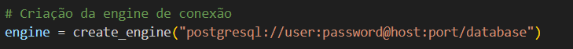
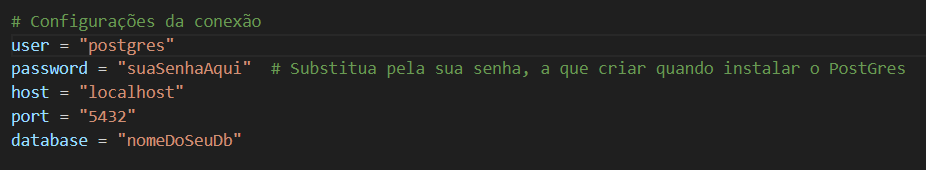
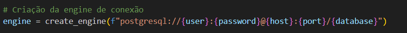
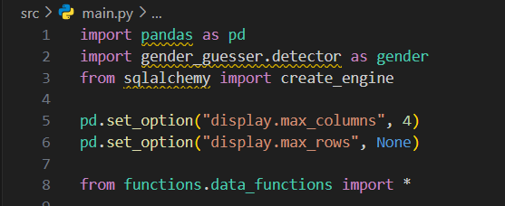

# Projeto ETL e Análise de Dados - Cookie Sales

Este projeto realiza um processo completo de **ETL (Extract, Transform, Load)** nos dados de venda da empresa Cookie Lovers. Os dados são extraídos de um arquivo Excel, transformados com limpeza e enriquecimento em Python (pandas), e finalmente carregados em um banco de dados **PostgreSQL** para análises posteriores.
O case envolveu aprimorar a forma da empresa cookie lovers (que estava em ascensão) armazenava e tratava seus dados.

O projeto foi proposto pela accenture no Acedemy DataAi 2025.

---

## Tecnologias Utilizadas

- Python 3.x
- pandas
- gender-guesser (utilizei a lib internacional, mas é recomendado a nacional se os nomes forem brasileiros)
- SQLAlchemy
- openpyxl
- SGBD - PostgreSQL
- (pgAdmin)
- PyCharm (IDE)
- Flake8 e Black (Para padronização e organização do código)

---

## Observações:

Recomendo criar um .venv para execução do projeto. Facilita na hora da gestão de dependências e importações.

Usar o Pycharm também é excelente. Na criação do projeto, a prórpia IDE faz a criação do ambiemte virtual, sendo necessário apenas executar os imports no terminal do projeto:

```bash
pip install pandas # A lógica para instalação das outras bibliotecas segue a mesma exemplo:
pip install flake8 ...
pip install black ...

```

### SqlAlchemy

Você terá que criar uma engine para conectar o banco e fazer a ingestão de dados.

Para facilitar e organizar, recomendo que crie varáveis para os parâmetros obrigatórios:

Apois isso, apenas substitua no lugar dos parâmetros


## Estrutura do Projeto

```py
PythonProject/
│
├── data/ # Planilhas de origem (.xlsx)
│ └── Base_de_vendas_COOKIE.xlsx
│
├── functions/ # Funções auxiliares para ETL
│ └── data_functions.py
│
├── src/
│ └── main.py # Script principal (ETL)
│
└── README.md # Documentação
```

## Alguns Exemplos do Código:

#### Carregamento do arquivo e criação dos dataframes com .copy() para evitar alterar na raiz do dado:


#### Imports que fiz na main:



---

## Como Executar o Projeto

- 1 Clone o repositório:
  ```bash
  git clone https://github.com/seu-usuario/nome-do-repositorio.git
  cd nome-do-repositorio
  ```
- 2 Instalação das dependências:

  ```bash
  pip install pandas
  pip install pip install sqlalchemy...

  ```

- 3 Execute a main:
  ```bash
  python (caminho da sua pasta).py
  ```

## Etapas do Processo ETL

### -> Extração:

- Leitura de todas as abas do Excel

- Correção de nomes de planilhas incorretos (tb_fonecedor → tb_fornecedor)

- Remoção de abas inúteis como Planilha1 e Planilha3

### -> Transformação

- Normalização de textos (CNPJ, UF, nomes, etc.)

- Preenchimento e dedução de colunas inexistentes como sexo com ajuda do pacote gender-guesser

- Correção de tipos e datas (data_venda)

- Cálculo de métricas e agrupamentos (mês, dia da semana, ticket médio)

### -> Carregamento

Inserção dos dados transformados diretamente no PostgreSQL via to_sql()

### -> Principais Métricas e Análises Realizadas

Distribuição de vendas por faixa etária, sexo, produto e período

- Produtos mais e menos vendidos

- Ticket médio por cliente

- Dias com maior e menor volume de vendas

- Feedbacks por produto

- Comparativo de consumo entre homens, mulheres usando gender-guesser

### Contribuição 🤝

Sinta-se livre para abrir issues e pull requests com sugestões ou melhorias!
